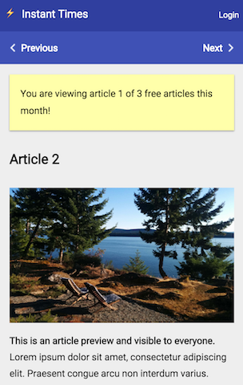

<!---
Copyright 2015 The AMP HTML Authors. All Rights Reserved.

Licensed under the Apache License, Version 2.0 (the "License");
you may not use this file except in compliance with the License.
You may obtain a copy of the License at

      http://www.apache.org/licenses/LICENSE-2.0

Unless required by applicable law or agreed to in writing, software
distributed under the License is distributed on an "AS-IS" BASIS,
WITHOUT WARRANTIES OR CONDITIONS OF ANY KIND, either express or implied.
See the License for the specific language governing permissions and
limitations under the License.
-->

# AMP Publisher Sample

This is a collection of samples demonstrating different features of [Accelerated Mobile Pages](https://www.ampproject.org).

## AMP Access Sample

This is a demo application for the [AMP Access](https://github.com/ampproject/amphtml/blob/master/extensions/amp-access/amp-access.md) component. AMP Access or “AMP paywall and subscription support” provides control to publishers over what content can be accessed by a reader and with what restrictions. You can try the demo [here](https://rocky-sierra-1919.herokuapp.com).



## Getting Started

This is a quick walk through the source code to get you started with AMP Access. Integrating AMP Access includes two steps:

1. AMP Access Endpoint implementation: integrate publisher paywall via AMP Access callbacks.
2. AMP HTML Configuration: configure the publisher AMP Access endpoints and define content access rules.

#### AMP Access Endpoint implementation

The first step is to implement the AMP Access callbacks in the publisher backend. The endpoint  URLs must be configured in each AMP HTML file using AMP Access:

* **authorization** ([api.js](controllers/amp-access/api.js#L31)): this credentialed CORS endpoint produces the authorization response that can be used in the content markup expressions to show/hide different parts of content (e.g. *subscriber*). The response is a free-form JSON object: it can contain any properties and values. 
* **pingback** ([api.js](controllers/amp-access/api.js#L89)): the main purposes for pingback is to count down meter when it is used. As a credentialed CORS endpoint it may contain publisher cookies. Thus it can be used to map AMP Reader ID to the reader's identity if they are logged in.
* **login** ([login.html](views/amp-access/login.html)): is a normal Web page with no special constraints, other than it should function well as a browser dialog. 
 
Both endpoints, authorization and pingback, must be credentialed CORS endpoints. This is configured in [amp-paywall-cors.js](middlewares/amp-access-cors.js).

#### AMP HTML Configuration

The second step is to integrate AMP Access into the AMP HTML files:

1. Configure the AMP Access endpoints ([article.html](views/amp-access/article.html#21)).

    ```html
    <script id="AMP Access" type="application/json">
      {
        "authorization": "<% host %>/amp-authorization.json?rid=READER_ID&url=CANONICAL_URL&_=RANDOM&ref=DOCUMENT_REFERRER",
        "pingback": "<% host %>/amp-pingback?rid=READER_ID&url=CANONICAL_URL&ref=DOCUMENT_REFERRER",
        "login": "<% host %>/login?rid=READER_ID&url=CANONICAL_URL"
      }
    </script>
    ```

2. Include the AMP Access  component ([article.html](views/amp-access/article.html#L30)):

    ```html
    <script async custom-element="AMP Access" src="https://cdn.ampproject.org/v0/amp-access-0.1.js"></script>
    ```

3. Define which parts of the AMP HTML file are visible to subscribers and non-subscribers ([article.html](views/amp-access/article.html#L51)):

    ```html
    <section AMP Access="access AND subscriber" amp-access-hide>
      Thanks for being a subscriber. You rock!
    </section>
    ```
    
That's it.

## Installation

Clone the repository via:

```none
$ git clone https://github.com/ampproject/amp-publisher-sample.git
```

Install [NodeJS](https://nodejs.org/) and run in the project dir:

```none
$ npm i
$ npm start
```

Try the demo at [http://localhost:8002/](http://localhost:8002/). 

## Contributing

Please see [the CONTRIBUTING file](CONTRIBUTING.md) for information on contributing to the AMP Project, and [the DEVELOPING file](DEVELOPING.md) for documentation on the AMP library internals and [hints how to get started](DEVELOPING.md#starter-issues).

## License

The AMP HTML Access Demo is made by the [AMP Project](https://www.ampproject.org/), and is licensed under the [Apache License, Version 2.0](LICENSE).
